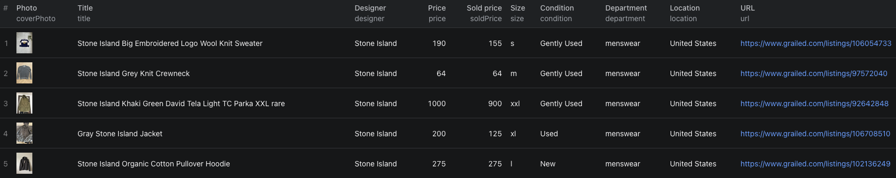

# How to Scrape Grailed Sold Prices in Node.js

This example calls the [Grailed Scraper](https://apify.com/piotrv1001/grailed-listings-scraper) on Apify. It does not implement a scraper from scratch.

## What this example does

- Searches Grailed menswear for five sold Stone Island listings
- Waits for the Actor run to finish
- Fetches the default dataset and prints each row
- Keeps the final `soldPrice` distinct from the listing `price`

## Prerequisites

- Node.js 18 or newer
- An Apify account and API token

## Installation

```bash
npm install
```

## Environment setup

Copy `.env.example` to `.env`, then set `APIFY_TOKEN` to your token. Do not commit `.env`.

## Usage

```bash
npm start
```

## Code example

```js
import { ApifyClient } from 'apify-client';
import 'dotenv/config';

// Initialize the ApifyClient with your Apify API token
// Set APIFY_TOKEN in your .env file (copy .env.example to get started)
const client = new ApifyClient({
    token: process.env.APIFY_TOKEN,
});

// Prepare Actor input
const input = {
    searchQuery: 'stone island',
    department: 'menswear',
    soldOnly: true,
    scrapeDetails: false,
    maxItems: 5,
    proxyConfiguration: { useApifyProxy: true },
};

// Run the Actor and wait for it to finish
const run = await client.actor('piotrv1001/grailed-listings-scraper').call(input);

// Fetch and print Actor results from the run's dataset (if any)
console.log('Results from dataset');
console.log(`💾 Check your data here: https://console.apify.com/storage/datasets/${run.defaultDatasetId}`);
const { items } = await client.dataset(run.defaultDatasetId).listItems();
items.forEach((item) => {
    console.dir(item);
});

// 📚 Want to learn more 📖? Go to → https://docs.apify.com/api/client/js/docs
```

## Example output

[`sample-output.json`](./sample-output.json) contains two abbreviated rows from our five-listing run. Compare `soldPrice`, `soldAt`, `categoryPath`, `size`, and `condition` before using sold listings as comparable sales. `price` and `priceDrops` are listing-price fields, not additional completed sales.



## Use cases

- Build sold-price comparisons for a specific designer and item type
- Review prices by size and condition
- Track recorded sale dates alongside final prices
- Shortlist listings that need photo or measurement review

## Try the Actor on Apify

**[Open the Grailed Scraper on Apify](https://apify.com/piotrv1001/grailed-listings-scraper)**

## Related resources

- [How to compare Grailed sold prices](https://www.falconscrape.com/blog/how-to-compare-grailed-sold-prices)

## License

MIT
